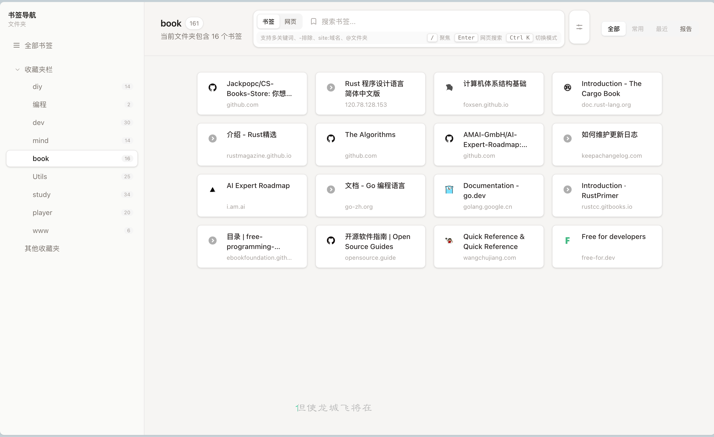
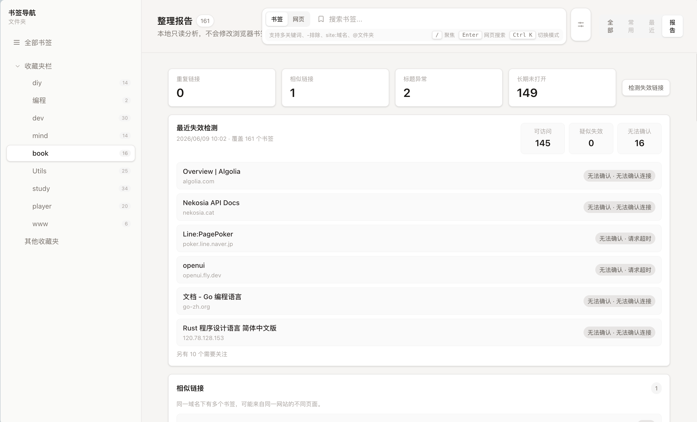
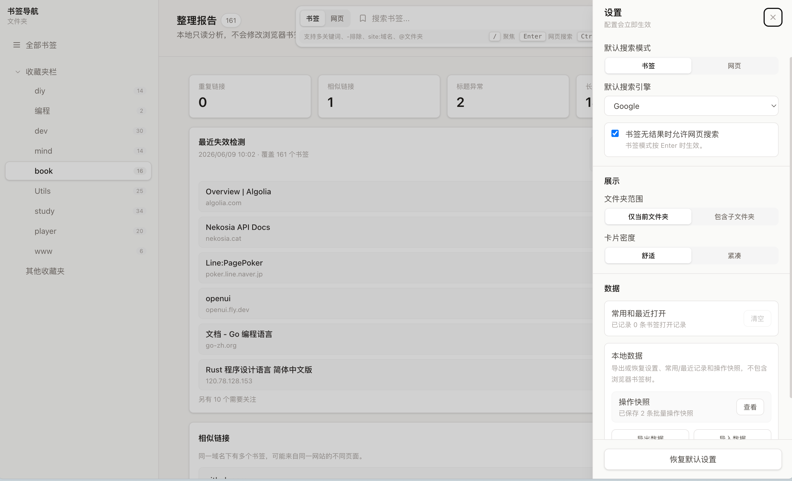

# Bookmark Nav

Bookmark Nav 是一个浏览器书签导航页扩展。它会替换新标签页，把 Chrome / Edge / Firefox 的书签变成一个可搜索、可分组、可轻量整理的网址导航页。

它适合书签很多、经常需要查资料、希望在新标签页快速打开常用入口的人。Bookmark Nav 保留浏览器原生书签树作为唯一真实来源，不需要账号，不提供云同步，也不会把书签上传到服务器。

## 功能亮点

- 新标签页书签导航：打开新标签页即可浏览所有书签。
- 文件夹侧边栏：按浏览器书签文件夹展示，支持只看当前文件夹或包含子文件夹。
- 快速搜索：按标题、域名、URL、文件夹路径匹配，并按相关性排序。
- 常用 / 最近打开：本地记录打开历史，自动生成高频入口。
- 书签管理：支持复制链接、编辑、移动、删除，以及批量复制、批量移动、批量删除。
- 整理报告：检查重复链接、相似链接、空文件夹、标题异常、长期未打开和疑似失效链接。
- 本地数据管理：导出/导入设置、常用/最近记录和操作快照。
- 最小权限：只申请 `bookmarks` 权限，不注入网页。

## 截图

截图素材见 [docs/screenshots](docs/screenshots)。







- 新标签页首页：侧边栏、搜索栏和书签网格。
- 搜索结果：展示匹配书签、文件夹路径和网页搜索入口。
- 整理报告：展示重复链接、长期未打开和最近失效检测记录。
- 设置面板：展示搜索、展示、数据管理配置。
- 批量确认：删除或移动前的确认弹窗。

## 安装

### Chrome / Edge

正式上架后，建议优先从 Chrome Web Store 或 Microsoft Edge Add-ons 安装。

如果使用 GitHub Release 安装：

1. 下载 `bookmark-nav-<version>-chrome.zip`。
2. 解压到本地目录。解压后的目录中应直接包含 `manifest.json`、`newtab.html`、`popup.html` 等扩展文件。
3. 打开浏览器扩展管理页。
4. 开启“开发者模式”。
5. 选择“加载已解压的扩展”。
6. 选择刚才解压出的扩展目录。

如果使用 GitHub Actions 的临时构建产物，下载并解压 `chrome-mv3` artifact 后，选择其中的 `chrome-mv3/` 目录。

Release 中的 `bookmark-nav-<version>-sources.zip` 是源码包，不是浏览器安装包；`checksums.txt` 用于校验下载文件完整性。

安装后打开新标签页即可使用。

### Firefox

GitHub Release 中的 Firefox 包是 `bookmark-nav-<version>-firefox.zip`。正式上架 Firefox Add-ons 前，建议仅用于开发测试或临时加载。

如果使用 GitHub Actions 的临时构建产物，下载并解压 `firefox-mv2` artifact 后，可在 Firefox 调试页面临时加载其中的扩展文件。

## 基本使用

### 浏览和打开书签

打开新标签页后，左侧是书签文件夹，右侧是书签卡片。点击卡片会在当前标签页打开对应网址。

设置中可以调整书签展示范围：

- 当前文件夹
- 当前文件夹及子文件夹

也可以切换卡片密度，让列表更舒适或更紧凑。

### 搜索书签

顶部搜索框会在所有书签中搜索。支持标题、域名、URL 和文件夹路径匹配。

常用搜索写法：

```text
react docs              # 同时匹配 react 和 docs
react -redux            # 匹配 react，但排除 redux
site:github.com react   # 只搜索 github.com 域名下的书签
@工作 react             # 只搜索文件夹路径包含“工作”的书签
```

快捷键：

- `/`：聚焦搜索框
- `Enter`：打开选中的书签，或执行网页搜索
- `↑ / ↓`：在搜索结果中移动选中项
- `Ctrl K` / `Cmd K`：切换书签搜索和网页搜索
- `Esc`：关闭弹窗/设置面板，或清空并退出搜索框

### 整理书签

Bookmark Nav 提供只读整理报告，帮助你先看到问题，再决定是否处理。

报告会展示：

- 重复链接
- 相似链接
- 空文件夹
- 标题异常
- 长期未打开书签
- 最近一次失效链接检测记录

失效链接检测需要手动触发，不会在后台自动检测。检测可能会对书签 URL 发起浏览器请求。

### 管理本地数据

设置面板的数据分组支持：

- 导出本地数据
- 导入本地数据
- 清空常用/最近记录
- 清理扩展本地数据

导出/导入只处理扩展本地设置、常用/最近记录和操作快照，不导出浏览器书签树，也不会修改浏览器书签。

## 权限与隐私

Bookmark Nav 只声明 `bookmarks` 权限。

该权限用于：

- 读取浏览器书签树并展示在新标签页
- 本地搜索书签
- 在用户确认后编辑、移动或删除书签
- 监听书签变化并刷新页面

Bookmark Nav 不声明 `content_scripts`，不向网页注入脚本，也不申请额外 host permissions。

数据处理方式：

- 浏览器书签来自 `chrome.bookmarks`，修改会直接作用于真实书签。
- 设置、常用/最近记录、操作快照和最近一次检测记录保存在扩展本地。
- Bookmark Nav 没有后端服务，不需要账号，不上传书签列表。
- favicon 会优先加载网站 `{origin}/favicon.ico`，失败后可能使用 DuckDuckGo favicon 服务兜底。
- 失效链接检测只在用户手动触发时运行。

## 与浏览器原生书签管理器的区别

Bookmark Nav 更适合日常打开新标签页时快速查找和轻量整理书签。

适合用 Bookmark Nav 做：

- 快速搜索并打开书签
- 按文件夹浏览书签
- 查看常用和最近打开
- 发现重复、长期未打开或疑似失效链接
- 批量复制、移动、删除少量书签

仍建议用浏览器原生书签管理器处理：

- 大规模拖拽排序
- 复杂文件夹重组
- 浏览器同步冲突处理

## 常见问题

**为什么需要 `bookmarks` 权限？**

用于读取书签树，并在用户确认后编辑、移动或删除书签。没有该权限，扩展无法展示和管理浏览器书签。

**会上传我的书签吗？**

不会。当前版本没有后端服务，不需要账号，不上传书签列表。

**会注入网页或读取网页内容吗？**

不会。Bookmark Nav 不声明 `content_scripts`，不注入网页。

**导入/导出会修改浏览器书签吗？**

不会。导入/导出只处理扩展本地设置、常用/最近记录和操作快照，不读写浏览器书签树。

**删除书签后能撤销吗？**

当前版本没有完整撤销功能。删除、批量删除、移动等高影响操作会先显示确认弹窗；后续路线图会继续加强操作历史和撤销能力。

**失效链接检测会自动运行吗？**

不会。检测需要用户手动点击开始，也可以关闭检测弹窗。

## 开发者与发布资料

README 主要面向用户。开发、发布和上架资料见：

- [需求规格](docs/spec.md)
- [开发计划](docs/plan.md)
- [长期路线](docs/roadmap.md)
- [GitHub Actions 与发布说明](docs/ci-cd-release.md)
- [发布检查清单](docs/release-checklist.md)
- [发布故障排查](docs/release-troubleshooting.md)
- [商店描述文案](docs/store-listing.md)
- [截图清单](docs/screenshots/README.md)

## 授权

本项目使用 MIT License，详见 [LICENSE](LICENSE)。
